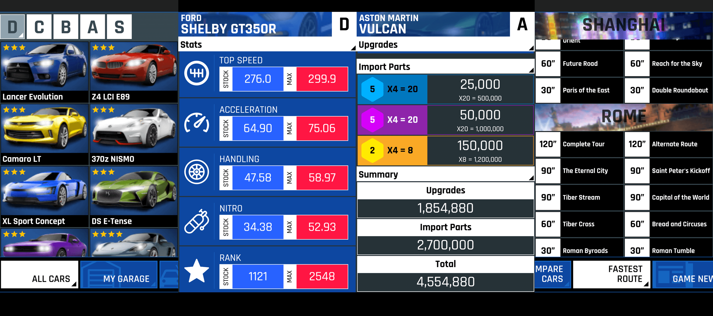

# A9Dex - A Detailed Asphalt 9: Legends Guide

## Features

* Performance statistics (Top speed, Nitro, Handling, Acceleration etc)
* STOCK & MAX configuration for cars
* Fastest route for each track
* Per Level cost for max upgrades
* Summarised upgrade costs
* Import parts information and costs
* Game news

## Disclaimer

The product names and images shown or represented are copyright and/or trademark of theirs respective copyright and/or trademark holders, which are in no way associated or affiliated with this application. Use of these names does not imply any co-operation or endorsement.

This application is developed and designed for educational purpose. **App does not include Advertisements or In-App purchases or Micro-Transactions.**

## App Content Licence

The app's content is licensed under [Attribution-NonCommercial 4.0 International (CC BY-NC 4.0)](https://creativecommons.org/licenses/by-nc/4.0/)
